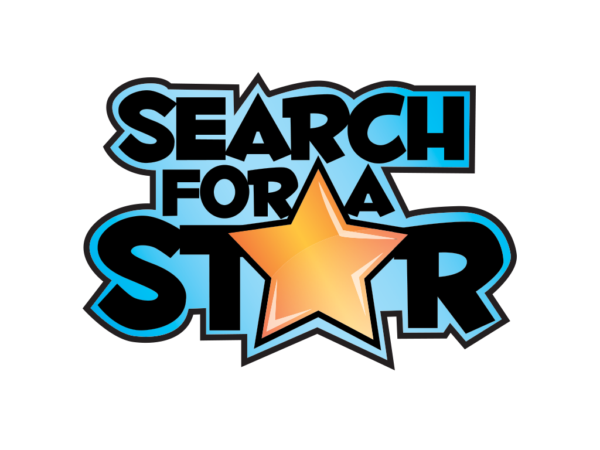
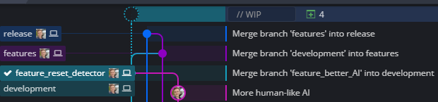

# 

| Author                 | Tahar Meijs                                                  |
| ---------------------- | ------------------------------------------------------------ |
| **Website**            | **[https://taharmeijs.com](https://taharmeijs.com)**         |
| **Project** repository | **[https://bitbucket.org/tntmeijs/sfas19/src/release/](https://bitbucket.org/tntmeijs/sfas19/src/release/)** |
| **Competition**        | **Rising Star**                                              |
| **University**         | **Breda University of Applied Sciences (BUAS)**              |

# Table of contents

- [Preface](#preface)
  - [About me](#about me)
  - [Motivation](#motivation)
  - [Credits](#credits)
- [Introduction](#introduction)
  - [Source control](#source control)
    - [Branches](#branches)
    - [My workflow](#my workflow)
  - [Game concepts](#game concepts)
    - [Snowball fight](#snowball fight)
    - [Skateboard paintball](#skateboard paintball)
  - [Core gameplay research](#core gameplay research)
- [Planned features](#planned features)
- [Problem solving](#problem solving)
- [Conclusion](#conclusion)

# Preface

## About me

Hello there, my name is Tahar Meijs. This is the second time I am joining this competition. I gave it a shot last year, but I was unable to deliver any project due to me having to prioritize some university assignments.

This time around, I will try my best to spend some more time on the competition. But, I will always prioritize university assignments over this competition.

## Motivation

I wanted to join the competition all the way back in 2017, but I did not have enough programming experience / knowledge at the time. Therefore, I decided to focus completely on learning new things in university so I could come back the next year and build a proper project.

When SFAS 2018 came around, I immediately joined. Too bad I messed up the C++ HackerRank test a bit. It was not bad, but it was not good either. My score was average (or perhaps slightly below average). Once phase 2 started, I had to spend all of my time on university assignments. As a result, I was only able to work on the game for a week or so. And that showed in the quality of the work I tried to deliver. The game was boring, barely had any AI, and was not fun at all.

This year, however, I feel much more comfortable with Unity3D and C++ in general. I signed up for SFAS 19 and got started on the HackerRank test. I managed to place in the top 30 across both Search for a Star, as well as Rising Star: an insane improvement over the test results from last year!

The only thing I am worried about is whether I will have enough time to work on the project. I am generally pretty bad at estimating tasks and planning my work accordingly. In addition to that, I also have to work on my university assignments, which take up around 30 hours a week. Add the commute from home to university to that and you will be looking at 60 to 80 hours a week spent on university-related things. This will leave me with very little time to work on the competition. Nevertheless, I will do my best to deliver a project by the end of January.

## Credits

Almost all of the art assets are made by [Kenney](https://kenney.nl).

For a more detailed list of the packages used in this project, please refer to the README.md file in the project folder.

# Source control

At the start of the project, all commits went into the main branch. This was convenient and worked quite well. However, as the project grew and became more complex, it became apparent that the project was in need of a better structure. I should have done this right at the start of the project...

## Branches

The project uses three branches (from most stable to least stable):

- Release: contains the latest **stable releases**, does not update frequently.
- Features: whenever the **development** branch is somewhat stable, this branch is updated.
- Development: **brand new features** are pushed to this branch.
- Feature_XXX: **new features** are implemented on branches originating from **development**. Highly unstable!

## My workflow

1. Clone the project to my local drive.
2. Pull latest changes.
3. Create a branch on the **development** branch named the same as the feature that will be added to the project.
4. Once the feature works as intended, it is merged into the **development** branch.
5. The **development** branch is **merged** into the **features** branch once the feature works properly.
6. The changes on **features** are pushed to **release** as soon as the build is stable and has enough features to consider it a big addition the game.

# Game concepts

At the start of the competition, I spent quite a bit of time doodling in a digital sketchbook to try and come up with a decent concept. The **time-lapse** I made during the development cycle of this project showcases some of the early brainstorming and concepting phase.

I started out by writing down the core concepts of the base project:

| **Third-person shooter**       | **Ammunition / pick-ups** | **Enemies can push the player** |
| ------------------------------ | ------------------------- | ------------------------------- |
| **Three-dimensional gameplay** | **Different enemy types** | **Various weapons**             |

My first ideas were quite cool, but also a bit too difficult to pull off within the time I have for this project. The following ideas were the best ones I had at the time:

| Single-player snowball fight         | **Bullet volleyball**           | **Stealth / spy game**                   |
| ------------------------------------ | ------------------------------- | ---------------------------------------- |
| **Titanfall 2-like parkour shooter** | **Turn-based tactical shooter** | **Action movie slow-motion bullet hell** |

I ended up really liking the snowball throwing game, so I went with that idea.

## Snowball fight

However, after some time, I found out that the game was not fun at all! In fact, the game was really boring. This caused me to lose motivation and made me think about dropping out of the competition. At that point, I only had around 1 month left. I could try and turn this mess into a fun game, but I could not see that happening any time soon. The only cool thing that made me want to continue the project was the snow shader I created, based on the distance-based tessellation shader used in Rise of the Tomb Raider.

I was quite happy with this result, but there was no game at all... So, I decided to try and come up with a new concept, one that would be more fun and less of a technology show-off.

## Skateboard paintball

After a while, I stumbled upon some really cool posts on Twitter about a skateboarding game. It looked like a lot of fun and a great way to turn this project of mine into a real game. At the point, I had learned how to model and rig basic things in Blender, so I was also planning on making some new art for the skateboarding game.

I spent way too much time fiddling around with the models, ramps, and other things in Blender. It was a lot of fun, but it did not help me progress at all! And to make things even worse, after jumping into the code, I discovered that a skateboarding game was quite tough to build. In fact, it is really difficult to make the board behave nicely with the game world. Add in more complex obstacles and tricks, and you will suddenly find yourself being unable to make it all work in such a short period of time...

## Racing game

After failing to make some good progress on two other concepts, I decided to throw away all the cool and original content and just build a racing game. That would be my submission, a game where you race 3 laps and try to come in first place. This is the project that I ended up submitting for the competition. In a later chapter, I will cover some of the difficulties I faced, the challenges I had to overcome, and reflect on the final result.

# Core gameplay research

# Planned features

# Problem solving

# Conclusion