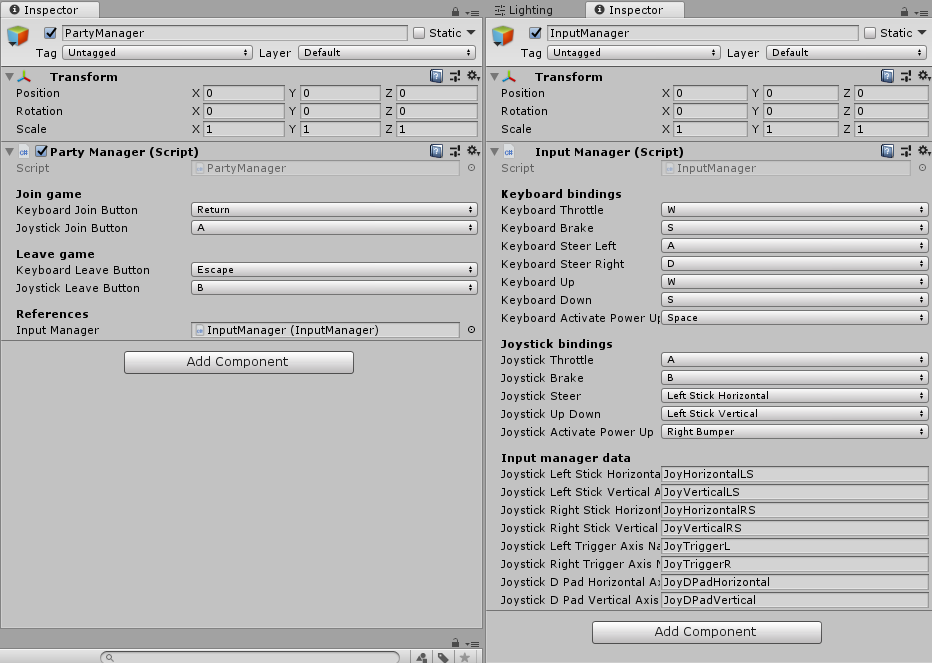
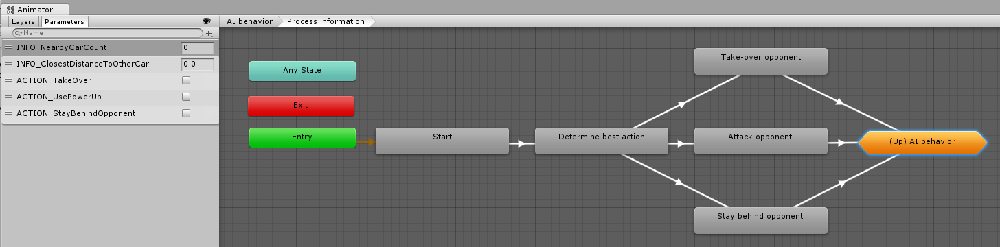

# 

| Author                 | Tahar Meijs                                                  |
| ---------------------- | ------------------------------------------------------------ |
| **Website**            | **[https://taharmeijs.com](https://taharmeijs.com)**         |
| **Project** repository | **[https://bitbucket.org/tntmeijs/sfas19/src/release/](https://bitbucket.org/tntmeijs/sfas19/src/release/)** |
| **Competition**        | **Rising Star**                                              |
| **University**         | **Breda University of Applied Sciences (BUAS)**              |

# Table of contents

- [Preface](#preface)
  - [About me](#about me)
  - [Motivation](#motivation)
  - [Credits](#credits)
- [Introduction](#introduction)
  - [Source control](#source control)
    - [Branches](#branches)
    - [My workflow](#my workflow)
  - [Game concepts](#game concepts)
    - [Snowball fight](#snowball fight)
    - [Skateboard paintball](#skateboard paintball)
    - [Racing game](#racing game)
  - [Core gameplay research](#core gameplay research)
    - [Planned features](#planned features)
- [Problem solving](#problem solving)
  - [Lack of time / motivation](#lack of time / motivation)
  - [Party system](#party system)
  - [Hover cars](#hover cars)
  - [Racing AI](#racing ai)
  - [Split screen camera configuration](#split screen camera configuration)
- [Conclusion](#conclusion)
  - [Post mortem](#post mortem)
  - [Self-reflection](#self-reflection)
  - [Future development](#future development)

# Preface

## About me

Hello there, my name is Tahar Meijs. This is the second time I am joining this competition. I gave it a shot last year, but I was unable to deliver any project due to me having to prioritize some university assignments.

This time around, I will try my best to spend some more time on the competition. But, I will always prioritize university assignments over this competition.

## Motivation

I wanted to join the competition all the way back in 2017, but I did not have enough programming experience / knowledge at the time. Therefore, I decided to focus completely on learning new things in university so I could come back the next year and build a proper project.

When SFAS 2018 came around, I immediately joined. Too bad I messed up the C++ HackerRank test a bit. It was not bad, but it was not good either. My score was average (or perhaps slightly below average). Once phase 2 started, I had to spend all of my time on university assignments. As a result, I was only able to work on the game for a week or so. And that showed in the quality of the work I tried to deliver. The game was boring, barely had any AI, and was not fun at all.

This year, however, I feel much more comfortable with Unity3D and C++ in general. I signed up for SFAS 19 and got started on the HackerRank test. I managed to place in the top 30 across both Search for a Star, as well as Rising Star: an insane improvement over the test results from last year!

The only thing I am worried about is whether I will have enough time to work on the project. I am generally pretty bad at estimating tasks and planning my work accordingly. In addition to that, I also have to work on my university assignments, which take up around 30 hours a week. Add the commute from home to university to that and you will be looking at 60 to 80 hours a week spent on university-related things. This will leave me with very little time to work on the competition. Nevertheless, I will do my best to deliver a project by the end of January.

## Credits

Almost all of the art assets are made by [Kenney](https://kenney.nl).

For a more detailed list of the packages used in this project, please refer to the README.md file in the project folder.

# Source control

At the start of the project, all commits went into the main branch. This was convenient and worked quite well. However, as the project grew and became more complex, it became apparent that the project was in need of a better structure. I should have done this right at the start of the project...

## Branches

The project uses three branches (from most stable to least stable):

- Release: contains the latest **stable releases**, does not update frequently.
- Features: whenever the **development** branch is somewhat stable, this branch is updated.
- Development: **brand new features** are pushed to this branch.
- Feature_XXX: **new features** are implemented on branches originating from **development**. Highly unstable!


## My workflow

1. Clone the project to my local drive.
2. Pull latest changes.
3. Create a branch on the **development** branch named the same as the feature that will be added to the project.
4. Once the feature works as intended, it is merged into the **development** branch.
5. The **development** branch is **merged** into the **features** branch once the feature works properly.
6. The changes on **features** are pushed to **release** as soon as the build is stable and has enough features to consider it a big addition the game.

# Game concepts

At the start of the competition, I spent quite a bit of time doodling in a digital sketchbook to try and come up with a decent concept. The **time-lapse** I made during the development cycle of this project showcases some of the early brainstorming and concepting phase.

I started out by writing down the core concepts of the base project:

| **Third-person shooter**       | **Ammunition / pick-ups** | **Enemies can push the player** |
| ------------------------------ | ------------------------- | ------------------------------- |
| **Three-dimensional gameplay** | **Different enemy types** | **Various weapons**             |

My first ideas were quite cool, but also a bit too difficult to pull off within the time I have for this project. The following ideas were the best ones I had at the time:

| Single-player snowball fight         | **Bullet volleyball**           | **Stealth / spy game**                   |
| ------------------------------------ | ------------------------------- | ---------------------------------------- |
| **Titanfall 2-like parkour shooter** | **Turn-based tactical shooter** | **Action movie slow-motion bullet hell** |

I ended up really liking the snowball throwing game, so I went with that idea.

## Snowball fight

However, after some time, I found out that the game was not fun at all! In fact, the game was really boring. This caused me to lose motivation and made me think about dropping out of the competition. At that point, I only had around 1 month left. I could try and turn this mess into a fun game, but I could not see that happening any time soon. The only cool thing that made me want to continue the project was the snow shader I created, based on the distance-based tessellation shader used in Rise of the Tomb Raider.


I was quite happy with this result, but there was no game at all... So, I decided to try and come up with a new concept, one that would be more fun and less of a technology show-off.

## Skateboard paintball

After a while, I stumbled upon some really cool posts on Twitter about a skateboarding game. It looked like a lot of fun and a great way to turn this project of mine into a real game. At the point, I had learned how to model and rig basic things in Blender, so I was also planning on making some new art for the skateboarding game.

I spent way too much time fiddling around with the models, ramps, and other things in Blender. It was a lot of fun, but it did not help me progress at all! And to make things even worse, after jumping into the code, I discovered that a skateboarding game was quite tough to build. In fact, it is really difficult to make the board behave nicely with the game world. Add in more complex obstacles and tricks, and you will suddenly find yourself being unable to make it all work in such a short period of time...


<div style="page-break-after: always;"></div> <!-- Force a page break here -->

## Racing game

I briefly tried to create a game where you would play mini-golf using a racing car, but I quickly found out that the AI would be really difficult to get right. The time-lapse on the project page will show some of the prototyping I did.

After failing to make some good progress on all the other concepts, I decided to throw away all the cool and original content and just build a racing game. That would be my submission, a game where you race 3 laps and try to come in first place. This is the project that I ended up submitting for the competition. In a later chapter, I will cover some of the difficulties I faced, the challenges I had to overcome, and reflect on the final result.


# Core gameplay research

The core gameplay in the base project was all about a (semi) top-down third-person shooter. The player was able to move around on the XZ plane, shoot with two different weapons, and kill enemies. Enemies were simple, had extremely basic AI, and would be able to push the player off the map.

The initial project with the snowball fight implemented most of the mechanics from the base project. I figured that a cool way to show-off some cool shader magic was by creating a show shader similar to the one seen in Rise of the Tomb Raider. But once I saw things coming together, it was almost as if it was a reskin of the base project with the exception of the snow deformation...

When I moved on to the paintball game, I wanted to keep the core gameplay the same, except this time the player would be able to move around in three-dimensional space using a hoverboard. The gameplay would be very similar to the project [Paul (@chonkurabb)](https://twitter.com/chonkurabb) is working on. I loved this gifs on Twitter, so I tried to use his game as an inspiration for mine.

Lastly, the racing concept. Due to me having to spend a great amount of time on university assignments, I decided to make the racing game as simple as possible. I did not plan any fancy features. Just a very basic Mario Kart clone in which you can drive around the track, collect power-ups, and race against AI or your friends.

## Planned features

The following chapter will only cover the racing game, as that is the concept I ended up "developing".

- **Party system**: allow players to play solo, or against their friends.
- **Arcade car physics**: use ray casts to make a car hover.
- **Racing AI**: all slots that cannot be filled by real players should be filled by AI players.
- **Booster power-up**: increase the maximum speed of a racing car for a short period of time.
- **Missile volley power-up**: fire missiles to damage the cars of other players.
- **Pit lane repairs**: when the car has taken damage, require a visit to the pit lane.
- **Dynamic split screen detection**: based on the number of players, the screen will be split in different ways.

As you can see, these features are all very simple, but it should be enough to make for a simple racing game. The most difficult feature to implement will be the party system, as the current Unity input system does not work nicely for those kind of things. Because the project used Unity 2018.2, I decided to stick with it. But in my own projects, I would have used the beta version of Unity in combination with their new [input system](https://github.com/Unity-Technologies/InputSystem).

# Problem solving

This section of the document will cover some of the challenges I had to overcome while developing this game. I will not cover every system in-depth, but I will try to give you a good impression of how I (tried to) solved the problems at hand.

## Lack of time / motivation

When I started with this competition, I made sure to spend some time on the project during the weekends. But, as the project I am working on at university matured and became more complex, I started having to spend my weekends on that instead. As a result, I could not work on the project as much as I would have liked. Additionally, I could only work on the game every 5 days or so, which meant that it took me some time to get used to all the system, the code base, and so forth. This made it difficult for me to really focus on the things that needed to be done. As a result, I slowly lost motivation to work on the project. I really wanted to work on it, but I simply could not bring myself to work on it every week. A few weeks went by where I barely had any time to work on any other projects than the university assignments.

Eventually, I made sure to start do at least a little bit of work during the weekends whenever I could. This allowed me to make a bit of progress every week. It eventually resulted in the game I submitted for this competition. I did not manage to finish every feature in-time, or polish it. But I tried to deliver a working project / game.

In hindsight, I should have really done a better job during preproduction. My initial idea sounded like fun, but it was not. If I would have spent some more time on the core gameplay, I could have prevented having to start over near the end of the competition. But, I do think that the current state of the project is way better now than it would have been if I decided to stick with the original concept.

## Party system

The first big issue I encountered when I started working on the game was that I would need some kind of party system. While this is not extremely difficult per se, it is fairly tricky to get it to work within Unity. See, Unity does not come with a nice input manager. The input bindings and the like for analog sticks is done via the input manager menu, which is based on hard-coded strings. I tried to build a somewhat abstracted input manager as a replacement for the default Unity input system, but I could not get rid of the Unity system entirely. I needed it for the analog readings from the axes on the joysticks.

I will not cover any of the code, because it would be useless to try to cover all of it in this document. Please have a look at the source code instead. This input system for a local party game is a bit complex, but it works really well. Players can join and leave the party, while the in-game input will always assign itself automatically to the correct player object.

The image below shows the result of the party manager and input manager script in Unity:



Using this input system, I was able to turn the input mess that is Unity's input editor, into this:

```cpp
// Retrieve the player input data from the input manager
Global.PlayerInputData inputData = InputManager.instance.GetInputDataForPlayer(m_PlayerID);
```

Where the `m_PlayerID` is either `PLAYER_ONE`, `PLAYER_TWO`, `PLAYER_THREE`, or `PLAYER_FOUR`.

This system took quite some time to implement, but I am really happy that I did. Even though my game project may not be finished, I do think that I am showing that I can write fairly complex systems in a clean and structured way. This feature is the one I am most proud of.

## Hover cars

Unity comes with a big collection of components ready to be used in a game. One of these components is the wheel collider. This can be used to create land vehicles that drive using realistic forces.

For my racing game, I found the wheel colliders to be too difficult to work with (way too many useless features for my game), and they were not as user-friendly as I had hoped. Therefore, I decided to write a simple script that could make any object behave like a hover car.

The way this work is pretty simple, really. You create a mesh and add a collider and rigid body to it. Then, you place empty child transforms along the outer edges of the object. In my case, I used the wheel positions for this. A ray is fired downwards from every hover point transform. Every time the ray hits, it applies a force in the opposite direction. This makes the ray behave like a spring system.

The point of intersection can be used to make the wheels of the vehicle stick to the ground. This makes the hovercar look and feel much more like an actual vehicle. The wheels do not need to have any kind of collision, because their are only a visual representation of the wheels. The real work is being done by the invisible ray cast spring system.

For a really in-depth tutorial as well as sample code for a system like this, please have a look at the this blog post of mine: [Simple hovercar in Unity3D](https://taharmeijs.com/simple-hovercar-in-unity3d/).

## Racing AI

To make the game more interesting, I had to add some kind of AI. At first I wanted the game to be local multiplayer only, but that would mean getting rid of all of the AI systems that were already part of the base project AI. Instead, I decided to spend a day or two on writing a system that allows cars to race around the tracks autonomously.

The system is pretty simple, but very effective. The designer first creates a track. Then, once all the pieces are in place, a system of waypoints needs to be added to the track. These waypoints will guide the AI towards its next position.


To make it easier for myself to design tracks and add the AI racing like to it, I wrote a small tool that overlays the AI waypoint system. This allows me to add nodes and see how the AI would react to it. Without this kind of visualization, it is really difficult to debug the AI racers.

Because I wanted to support track splits and pit lanes, I had to come up with a system that allows the track to be split into two child "tracks". In the image above, a cyan line is used to indicate a road that is split in two, while the red line shows the pit lane. Yellow lines are the regular track.

The AI line following algorithm is pretty simple. The AI is assigned a start node index. Then, it moves towards the node. Once the distance to the node falls below a certain threshold, the node index is advanced by one, making the AI move towards the next node. This keeps going on until either we hit the last node and the index wraps around, or we hit a special type of node. A special node is either a track split, or the pit lane entrance.

When the track splits in two (cyan line), the AI randomly decides to go either left or right. The pit lane is not random at all and uses the health system as provided by the base project. When the health of a car falls below a certain threshold, the AI tries to enter the pit lane.

I tried to build a state machine system for the AI, but due to a lack of time, I was unable to finish it. The idea was to repurpose the built-in Unity Animator system. Unity has a class named `StateMachineBehaviour`. Custom classes can derive from this class, which allows programmers to write custom state nodes for the Animator window. For this AI, I wanted to use it to influence the driving of the car by making it scan for other cars, detect power-ups, and make "smart" decisions such as when to go to the pit lane and when to skip it.



## Split screen camera configuration

Because my game would need support for 1 to 4 players, I decided that I would need to write a simple camera creation script that would divide the viewport into multiple smaller viewports. Depending on the number of players, the game chooses a predetermined split-screen configuration.

The initial idea was to check the number of players after the party has been confirmed. Then, the game would present the players with all possible split screen configurations for their set-up and let them vote on the best one. While this idea was cool, I did not have enough time to create yet another menu scene. Instead, I just predefined some camera configurations depending on the number of players.

To create the camera viewport configuration, I wrote a little class with one public method:

```cpp
// Create four viewports of equal size
cameraCreator.CreateSplitScreenSetup(CameraCreator.SplitStyle.QuadCamera);
```

The example code above splits the viewport into four smaller viewports, but there are way more configurations possible that that. I have implemented viewport configurations for these split styles:

```cpp
public enum SplitStyle
{
    Invalid = -1,
    SingleCamera,           // Cover the complete screen using camera #1
    DoubleCameraHorizontal, // Two equally-sized views horizontally
    DoubleCameraVertical,   // Two equally-sized views vertically
    TripleCameraQuad,       // Four equally-sized views with the bottom-right tile unused
    TripleCameraTop,        // Two equally-sized views on the top and a big view on the bottom
    TripleCameraBottom,     // Two equally-sized views on the bottom and a big view on the top
    TripleCameraLeft,       // Two equally-sized views on the left and a big view on the right
    TripleCameraRight,      // Two equally-sized views on the right and a big view on the left
    TripleCameraHorizontal, // Three equally-sized views horizontally
    TripleCameraVertical,   // Three equally-sized views vertically
    QuadCamera              // Split the screen in four equally-sized views
}
```

Example of a split screen configuration when `TripleCameraBottom` is used to split the viewport:


# Conclusion

## Post mortem

During the course of this project, I achieved quite a lot, however, there is a lot of room for improvement as well. This paragraph aims to highlight and briefly discuss the things I achieved, as well as the challenges I face while working on this project.

### Achievements

#### Advanced gameplay / tool systems

In my day-to-day university work, I barely do any gameplay or tools programming. I am currently part of a team of programmers that work on a real-time ray-tracing library named [Wisp (link)](https://github.com/teamwisp). This is mostly software engineering, so I do not have a lot of experience with gameplay systems.

Nevertheless, I do think that I did a pretty good job at writing some of the gameplay systems. Most notably the racing AI and the input system abstraction layer. Overall, I am really happy with these two things, as they were completely new to me and rather tricky to implement. I wrote them in a fairly modular way, so I should be able to reuse these systems in my future projects if I ever need similar solutions.

#### Learning Unity3D

As I just stated, I mainly focus on low-level things and more software engineering concepts. Even though I am enrolled in a course called "International Game Architecture and Design", I only worked on gameplay systems in my first year. Every project that came after that always involved writing a custom (rendering) engine from scratch.

So, having to suddenly work with a commercial-grade engine such as Unity3D was a big difference. I had only used this engine a couple times before for some personal projects and experiments. So I already knew a bit of C#, but most of my experience is in C++. This resulted in me mixing up some language features every now and then.

Now that the SFAS competition is coming to an end, I can confidently say that I feel pretty comfortable working with Unity3D now. I will start learning more advanced features such as the scriptable render pipeline soon, because I really enjoyed working with the engine. I would love to do some more experiments and projects with this engine in the near future.

#### Blender experience

So this is not really related to programming, but I just wanted to say that I learned a great deal about Blender. Before I grabbed the Kenney asset packs, I tried to create my own models in Blender. This meant I had to learn how to create 3D models, texture them, and do some basic rigging.

I will probably never be a 3D modeler professionally, but I thoroughly enjoyed playing around with Blender. I learned how to build 3D models using 3D images (front, top, side view), apply textures and vertex color, rig a character, and export animations to Unity from within Blender.

<div style="page-break-after: always;"></div> <!-- Force a page break here -->

### Challenges

#### Working on multiple projects

One of the most difficult things I had to do during this competition was managing two projects at the same time. For a university assignment, I have to work in a team on a year-long project. I am expected to put in 30 hours a week. But if you include commuting from home to university and the occasional lecture, it adds up to around 60 to 70 hours a week. This made it difficult for me to find the motivation to do more work outside of university work. I think I spent around 5 hours a week on this project.

I should have tried to plan my competition work and my university work better. Perhaps I should have tried to get some work for SFAS done during my morning commute...

#### Motivation

As a result of the lack of time (and thus, lack of progress), I did not feel as motivated as I did when I started working on the project. Do not get me wrong, I absolutely love to work on games and software in general, but once you reach that 60 or 70 hours a week spent on university assignments, it is difficult to bring yourself to start working on yet another project or assignment.

#### Scoping

I really over-scoped this project. Initially, I thought I would have more time to work on it, but as the project progressed and I could not spend as much time working on the game, I did not reduce scope. I should have re-scoped the project earlier. Perhaps it would have allowed me to finish it completely.

## Self-reflection

I think I did a pretty good job at working towards the final goal. I used planning software such as Hack 'n Plan, made design sketches, added a timeline, and more... The quality of my work was pretty good and the code was fairly clean and well structured.

But, you can only do so much in a few weeks. In hindsight, I should have continued with my original concept. It would have probably resulted in a boring game, but I would at least have a proper game. Now I have a half-finished prototype.

## Future development

Although I highly doubt I will continue with this project, I may grab some of the assets and release them as stand-alone asset packs. The game project itself will probably be abandoned after this competition is over. As much as I would have liked to continue with it, I simply do not see this game becoming fun any time soon. I have lots of new ideas for interesting games thanks to this competitions, so stay tuned for that!